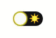

# react-lunar-toggle [](https://www.npmjs.com/package/react-lunar-toggle)

🌑 🌒 🌓 🌔 🌕 🌖 🌗 🌘 🌑



react-toggle with lunar phases, for fancy dark mode toggles.

## Props

Props except date: Date inherited from [react-toggle](https://github.com/aaronshaf/react-toggle), further info can be found at react-toggle repo.

The component takes the following props.

| Prop              | Type       | Description                                                                                                                                                                                                  |
| ----------------- | ---------- | ------------------------------------------------------------------------------------------------------------------------------------------------------------------------------------------------------------ |
| `date`            | _Date_     | Optional. If not set today's date will be used                                                                                                                                                               |
| `checked`         | _boolean_  | If `true`, the toggle is checked. If `false`, the toggle is unchecked. Use this if you want to treat the toggle as a controlled component                                                                    |
| `defaultChecked`  | _boolean_  | If `true` on initial render, the toggle is checked. If `false` on initial render, the toggle is unchecked. Use this if you want to treat the toggle as an uncontrolled component                             |
| `onChange`        | _function_ | Callback function to invoke when the user clicks on the toggle. The function signature should be the following: `function(e) { }`. To get the current checked status from the event, use `e.target.checked`. |
| `onFocus`         | _function_ | Callback function to invoke when field has focus. The function signature should be the following: `function(e) { }`                                                                                          |
| `onBlur`          | _function_ | Callback function to invoke when field loses focus. The function signature should be the following: `function(e) { }`                                                                                        |
| `name`            | _string_   | The value of the `name` attribute of the wrapped \<input\> element                                                                                                                                           |
| `value`           | _string_   | The value of the `value` attribute of the wrapped \<input\> element                                                                                                                                          |
| `id`              | _string_   | The value of the `id` attribute of the wrapped \<input\> element                                                                                                                                             |
| `icons`           | _object_   | If `false`, no icons are displayed. You may also pass custom icon components in `icons={{{checked: <CheckedIcon />, unchecked: <UncheckedIcon />}}`                                                          |
| `aria-labelledby` | _string_   | The value of the `aria-labelledby` attribute of the wrapped \<input\> element                                                                                                                                |
| `aria-label`      | _string_   | The value of the `aria-label` attribute of the wrapped \<input\> element                                                                                                                                     |
| `disabled`        | _boolean_  | If `true`, the toggle is disabled. If `false`, the toggle is enabled                                                                                                                                         |

## Installation

```bash
npm install react-lunar-toggle
```

## Usage

```jsx
import LunarToggle from 'react-lunar-toggle'
...
<LunarToggle />
```

example

```jsx
import LunarToggle from 'react-lunar-toggle'

const App = props => {

  const [darkMode, toggleDarkMode] = useState(false)

  return (
    <LunarToggle
      checked={darkMode}
      onChange={(e) => toggleDarkMode(e.target.checked)}
    />
  )
}


## Styling

you need to add the styles from [src/styles.css](src/styles.css)
```
